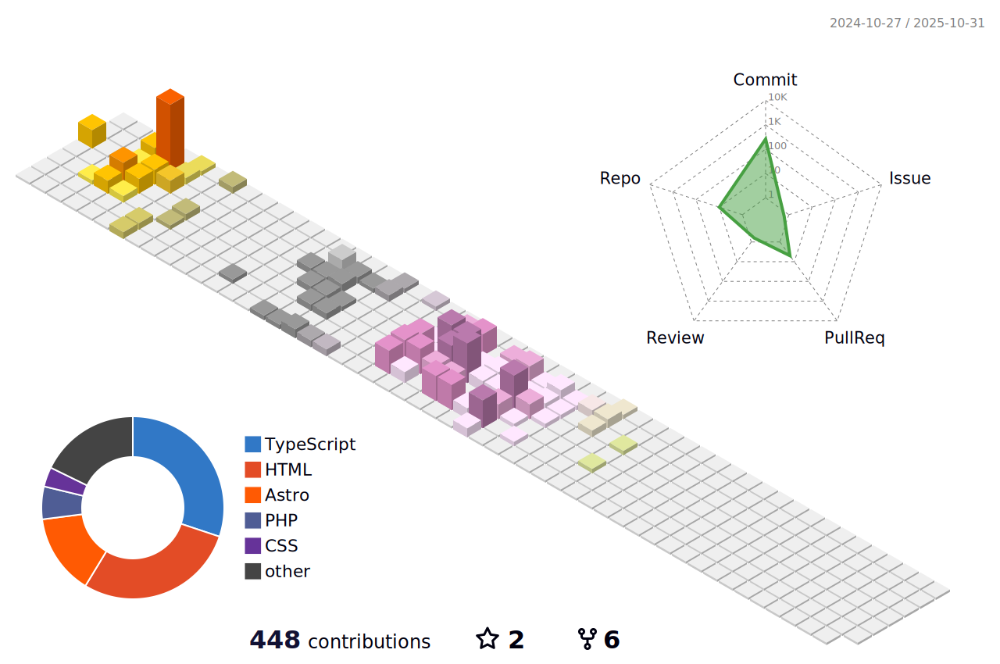

# 🌟 Welcome to My GitHub Profile! 🌟

## 👋 Hello, I'm Luis!

I'm a passionate web developer and tech enthusiast from Spain. I love creating innovative solutions and building dynamic, user-friendly web applications.

---

## 🚀 About Me

- 🔭 Working on exciting new projects
- 🌱 Learning advanced front-end frameworks and UI/UX design
- 👯 Open to collaborating on open-source projects
- 🤔 Interested in full-stack development, responsive web design, and AI
- 💬 Ask me about web development, tech trends, or anything tech-related!

---

## 🔧 Technologies & Tools

### Frontend

### Backend

### Tools

### Learning

---

## 💼 Projects

- **LearnZone** - A platform for students to upload notes and exam dates.
- **[Wave-Tasker](https://wave-tasker.vercel.app)** - Web app for managing tasks and time efficiently.
- **[React-Learn](https://react-learnisc.vercel.app)** - A learning resource for new developers to understand React features.

Check out my GitHub repositories for more projects and let's improve our coding skills together!

---

## 💻 Operating Systems

---

## 🌟 GitHub Stats

---

## 📫 Let's Connect

- 
- **Portfolio**: [Nisc-Portfolio](https://nisc-portfolio.vercel.app)
- **Email**: luisnisc30mayo2005@gmail.com
- 

Feel free to reach out for collaboration, questions, or just to chat about tech! 😊
